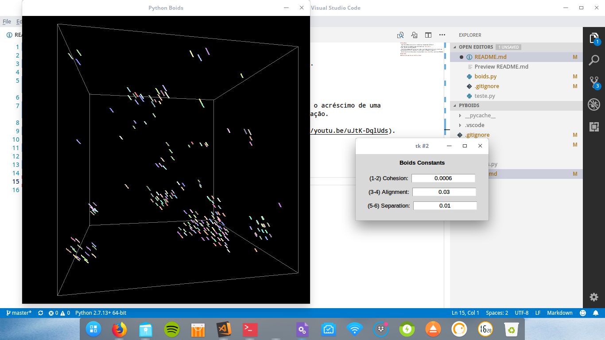
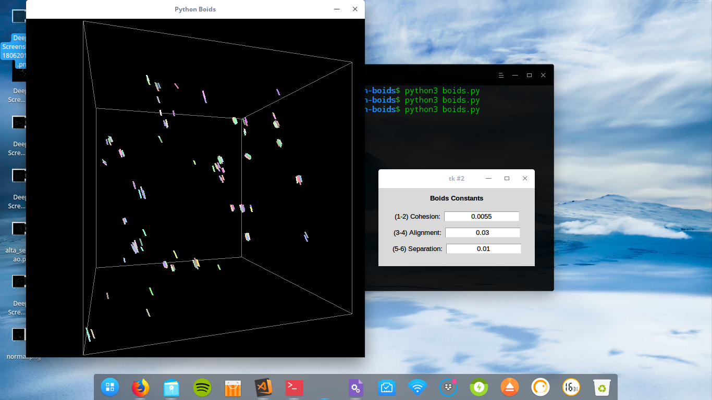
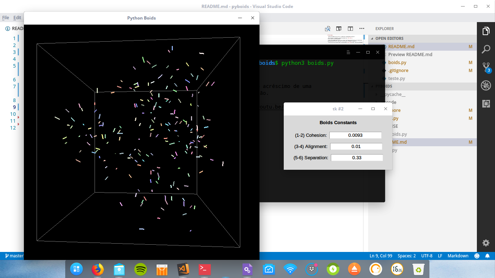

# Python Boids

- Algoritmo do Boids em um universo tridimensional implementado em Python 3.

- Esse algoritmo foi baseado no algoritmo proposto por [Peter Keller](https://github.com/tmarble/pyboids).

- Foram feitas algumas modificações e acréscimos. A principal alteração foi o acréscimo de uma janela que permite alterar o peso das forças de coesão, alinhamento e separação.

- O efeito da alteração desses pesos são apresentados [nesse vídeo](https://youtu.be/uJtK-DqlUds).

## Resultados

### Execução do algoritmo sob condições normais

### Execução do algoritmo com alta coesão

### Execução do algoritmo com alta separação

